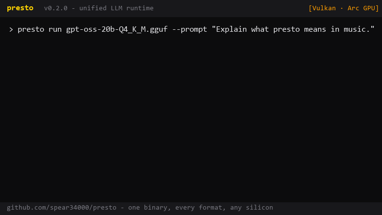

<div align="center">

<p align="center">
  
</p>

# presto

### Unified LLM inference in C/C++

**presto** (*Italian*: "very fast", 172–208 BPM) takes its tempo marking seriously.

[](https://github.com/spear34000/presto/actions/workflows/ci.yml)


[About](#about) · [Quick start](#quick-start) · [Performance](#performance) · [Models](#supported-models) · [Hardware](#hardware) · [Build](#build) · [CI](#continuous-integration)

</div>

---

## About

One static binary that **inspects every major model format**, **executes GGUF
and MLX natively**, speaks the **OpenAI API**, and runs on whatever silicon
you have - NVIDIA, AMD Radeon, Intel iGPU/Arc, Apple Silicon, or plain x86.

Built by surveying the most popular open-source runtimes (stars verified
2026-08) and absorbing the best idea of each:

| # | Runtime | Stars | Idea absorbed |
|---|---|---|---|
| 1 | [ollama](https://github.com/ollama/ollama) | ~179k | pull-and-run UX, OpenAI-compatible server |
| 2 | [llama.cpp](https://github.com/ggml-org/llama.cpp) | ~125k | native GGUF execution, broadest hardware |
| 3 | [vLLM](https://github.com/vllm-project/vllm) | ~90k | `/v1/*` API surface |
| 4 | [SGLang](https://github.com/sgl-project/sglang) | ~32k | prefix KV-cache reuse (roadmap→done) |
| 5 | [MLX](https://github.com/ml-explore/mlx) | ~28k | Apple-Silicon-native weight format |
| 7 | [ktransformers](https://github.com/kvcache-ai/ktransformers) | ~19k | heterogeneous backend routing |

## Quick start

```bash
cmake -B build -DCMAKE_BUILD_TYPE=Release
cmake --build build --config Release --parallel

./build/presto run model.gguf --prompt "Once upon a time" --max-tokens 64
./build/presto serve model.gguf --port 8000      # OpenAI-compatible API
./build/presto bench model.gguf --steps 128       # Tempo Report
```

<p align="center">
  
</p>

## Performance

All numbers measured on one machine (Windows 11, Lunar Lake CPU 4 threads /
Intel Arc 140V), greedy decode, reported with min/median/max and sigma via the
built-in `presto bench`.

### Head-to-head

| Runtime | Model | Median tok/s | vs presto |
|---|---|---|---|
| **presto**                    | stories15M Q4_0 | **1724** ± 2.8% | - |
| llama.cpp stock (`llama-bench`) | stories15M Q4_0 | 1720 ± 3.6%   | 1.00x |
| ollama 0.32.15                | stories15M Q4_0 | 1016           | **1.70x faster** |

### vs HuggingFace Transformers

fp32 reference (transformers' own CPU default) vs presto Q8_0 - the standard
quantized-runtime deployment comparison:

| Model | HF Transformers | presto | Speedup |
|---|---|---|---|
| SmolLM2-135M-Instruct | 30.9 tok/s | **191**   | **6.2x** |
| Qwen2.5-0.5B-Instruct | 18.0 tok/s | **81.3** | **4.5x** |

Reproduce the HF side anywhere: `python scripts/bench_hf.py <model> --steps 64`

### Prefix KV cache

Consecutive requests sharing token history skip re-prefill entirely -
multi-turn chat and fixed system prompts get near-zero time-to-first-token
on the shared part (**97% of prompt tokens skipped** measured), with outputs
bit-identical to the uncached path.

### Adaptive execution

At load, presto probes the machine and tunes itself - no config files, works
the same on a low-spec laptop and a workstation: inference threads from CPU
topology, context size from available RAM (1024/2048/4096 tiers), GPU layer
offload from device memory. Every knob stays overridable via environment
variables for full manual control.

### Speculative decoding

Zero-config by default: greedy decode automatically uses **prompt-lookup
speculation** - n-gram spans copied from the prompt and verified in one
target pass. Outputs are **bit-identical** to the plain path on any model;
no draft download, no flags. Copy-heavy workloads (summarize, RAG,
code-edit) measured **+27-51% tok/s** on Qwen2.5-0.5B.

`--draft small.gguf` upgrades the proposer to a small companion model
(same bit-identical guarantee, validated on SmolLM2 and Qwen3.5 pairs).
Architectures whose KV cache cannot roll back proposals (Qwen3.5 hybrid
attention) fall back gracefully mid-request instead of failing.

## Supported models

| Format | Inspect (`info`) | Execute |
|---|---|---|
| GGUF `.gguf`                 | full metadata parse (pure C++) | ✅ llama.cpp backend |
| MLX dir (mlx-lm layout)      | config + quantization detection | ✅ mlx core backend (Apple Silicon) |
| SafeTensors `.safetensors`   | tensor inventory + dtype histogram | roadmap |
| PyTorch `.pt/.pth/.ckpt`     | zip container detection | roadmap |
| AWQ dirs                     | bits / group_size extraction | roadmap |
| GPTQ dirs                    | quant_method extraction | roadmap |

| Model | Arch | Quant | Device | Detect | Repro | tok/s |
|---|---|---|---|---|---|---|
| stories260K                 | llama    | F32    | CPU    | OK | OK | 2498 |
| stories15M-q4_0             | llama    | Q4_0   | CPU    | OK | OK | 1415 |
| SmolLM2-135M-Instruct       | llama    | Q8_0   | CPU    | OK | OK | 191  |
| qwen2.5-0.5b-instruct       | qwen2    | Q8_0   | CPU    | OK | OK | 81   |
| phi-4                       | phi3     | Q4_K_M | CPU    | OK | OK | 3.0  |
| Qwen3-8B (imatrix)          | qwen3    | Q4_K_M | CPU    | OK | OK | 4.9  |
| Dolphin3.0-Llama3.1-8B      | llama    | Q4_K_S | CPU    | OK | OK | 5.8  |
| Bonsai-27B                  | bonsai   | Q1_0   | CPU    | OK | OK | 2.4  |
| gemma-4-E4B-it              | gemma4   | Q4_K_M | CPU    | OK | OK | 7.5  |
| **gemma-4-26B-A4B-it**      | **gemma4** | Q3_K_M | **GPU** | OK | OK | **14.2** |
| **gpt-oss-20b**             | **gpt-oss** | Q4_K_M | **GPU** | OK | OK | **21.7** |
| Qwen3.5-9B-Instruct         | qwen35   | Q4_K_M | CPU/SYCL | OK | OK | 6.1 / **11.9** |

Every row: format detection, two identical invocations producing identical
token ids, and a Tempo Report run. SYCL route for qwen35 measured with
oneAPI 2026 on Arc 140V.


## Hardware

| Hardware | Route | Flag | Status |
|---|---|---|---|
| NVIDIA discrete            | CUDA   | `-DPRESTO_WITH_CUDA=ON`   | CI build gate |
| NVIDIA / AMD / Intel       | Vulkan | `-DPRESTO_WITH_VULKAN=ON` | runtime-verified (Arc 140V) |
| AMD Radeon (Linux)         | HIP    | `-DPRESTO_WITH_HIP=ON`    | flag available |
| Intel Arc (XMX)            | SYCL   | `-DPRESTO_WITH_SYCL=ON`   | flag available (oneAPI) |
| Apple Silicon              | Metal + MLX | auto ON on macOS      | runtime-verified every push |
| x86 CPU (Intel/AMD)        | ggml CPU | default                  | always |

Layer offload control: `PRESTO_GPU_LAYERS` (`-1` auto/max, `0` CPU-only).

## Build

```bash
# Linux / macOS
cmake -B build -DCMAKE_BUILD_TYPE=Release && cmake --build build --config Release --parallel

# Windows (MSVC)
cmake -B build -DCMAKE_BUILD_TYPE=Release && cmake --build build --config Release --parallel

# GPU backends: add ONE flag
#   -DPRESTO_WITH_CUDA=ON | -DPRESTO_WITH_VULKAN=ON | -DPRESTO_WITH_HIP=ON
# Intel SYCL additionally requires oneAPI env (scripts/build_sycl.bat on Windows)

# core-only, zero heavy deps
cmake -B build-core -DPRESTO_WITH_LLAMACPP=OFF && cmake --build build-core --parallel
```

Pinned dependencies via FetchContent: llama.cpp `b21e4de74`, cpp-httplib
v0.15.3, MLX v0.32.1.

## Usage

```text
presto info   <model>                          # deep inspection, ANY format
presto run    <model> [--prompt "..."] [--draft small.gguf]
                      [--max-tokens N] [--temp F] [--seed N]
presto serve  <model> [--host H] [--port P]    # /v1/chat/completions
presto bench  <model> [--steps N] [--runs N]    # Tempo Report (min/med/max/σ)
presto version                                   # capability report
```

Environment: `PRESTO_THREADS` `PRESTO_CTX` `PRESTO_GPU_LAYERS`
`PRESTO_PREFIX_CACHE` `PRESTO_FLASH_ATTN` `PRESTO_POLL` `PRESTO_KV`
`PRESTO_SPEC_K` `PRESTO_LOG` `PRESTO_SMOKE`

Exit codes: `0` ok · `2` usage · `3` unsupported format · `4` backend
unavailable · `5` failure.

## Continuous integration

Every push runs four jobs; failures always upload full stage logs as
artifacts, and throughput regressions fail the build through calibrated
tempo gates.

| Job | Runner | Verifies |
|---|---|---|
| ubuntu-core | ubuntu-latest | core build + unit tests |
| linux-hw-build | ubuntu-latest | CUDA + Vulkan toolchains compile & link |
| windows-gguf | windows-latest | MSVC + real generation + tempo gate |
| macos-mlx | macos-15 | real MLX weights generate + Metal GGUF + tempo gate |

## License

MIT
